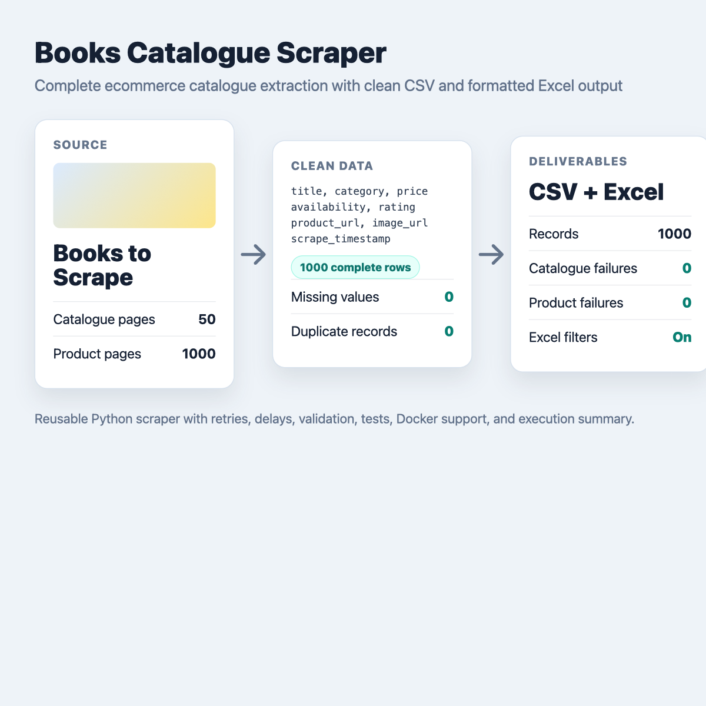
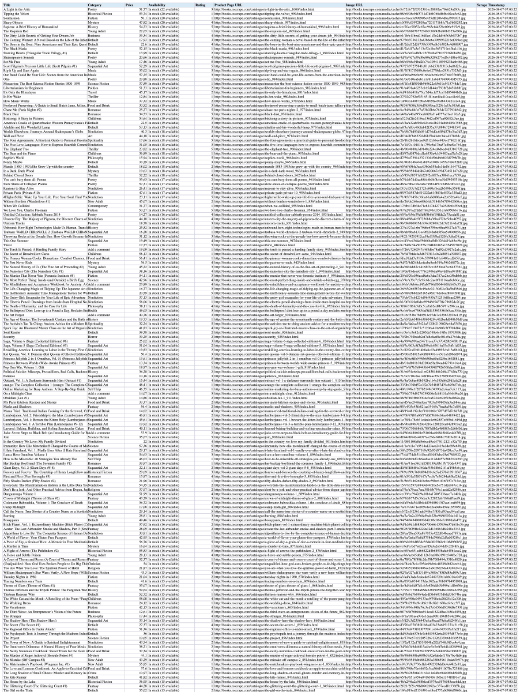

# Books Catalogue Scraper

A reusable Python scraper that extracts a complete ecommerce catalogue into clean CSV and Excel files.



This project uses [Books to Scrape](https://books.toscrape.com/), a public demonstration ecommerce website built for scraping practice. It processes catalogue pagination, visits product-detail pages, validates the extracted rows, removes duplicate products, and exports buyer-friendly deliverables.

## Business Use Cases

The same scraping pattern can be adapted for:

- Competitor product catalogues
- Price and stock monitoring
- Marketplace listings
- Public directories
- Research datasets
- Recurring catalogue-change detection

## Extracted Fields

- `title`
- `category`
- `price`
- `availability`
- `rating`
- `product_url`
- `image_url`
- `scrape_timestamp`

## Features

- Pagination across the full product catalogue
- Product-detail extraction from each item page
- Request retries with configurable backoff
- Polite request delays
- Data validation and missing-value checks
- Duplicate removal by product URL
- CSV output
- Formatted Excel output with frozen header row, auto-filter, column widths, and readable number/date formats
- Execution summary with quality metrics
- Docker support
- Small parser and validation tests

## Results

Latest full run:

```text
Pages processed: 50
Records extracted: 1000
Records complete: 1000
Records partial: 0
Duplicate records: 0
Catalogue pages failed: 0
Product pages failed: 0
Invalid records: 0
Missing values: 0
Execution time: 130.67s
Output file: output/books.csv
Excel file: output/books.xlsx
```



Generated files:

- `output/books.csv`
- `output/books.xlsx`
- `output/books-small.csv`
- `output/books-small.xlsx`

## Sample Output

Small sample file: `output/books-small.csv`

| title | category | price | availability | rating |
| --- | --- | --- | --- | --- |
| A Light in the Attic | Poetry | £51.77 | In stock (22 available) | 3 |
| Tipping the Velvet | Historical Fiction | £53.74 | In stock (20 available) | 1 |
| Soumission | Fiction | £50.10 | In stock (20 available) | 1 |

## Setup

```bash
python3 -m venv .venv
source .venv/bin/activate
pip install -r requirements.txt
```

## Usage

Run the full scraper:

```bash
python src/scraper.py
```

Run a quick test scrape:

```bash
python src/scraper.py --max-pages 1 --max-books 20 --output output/books-small.csv --excel-output output/books-small.xlsx
```

CSV-only run:

```bash
python src/scraper.py --no-excel
```

Reliability options:

```bash
python src/scraper.py --delay 0.2 --retries 3 --backoff-factor 0.5 --log-level INFO
```

## Docker

Build the image:

```bash
docker build -t books-catalogue-scraper .
```

Run the scraper and write outputs to the local `output/` folder:

```bash
docker run --rm -v "$PWD/output:/app/output" books-catalogue-scraper
```

Run a small Docker scrape:

```bash
docker run --rm -v "$PWD/output:/app/output" books-catalogue-scraper \
  python src/scraper.py --max-pages 1 --max-books 20 \
  --output output/books-small.csv --excel-output output/books-small.xlsx
```

## Tests

```bash
python -m unittest discover -s tests
```

## Screenshots

- `screenshots/portfolio-overview.png`
- `screenshots/source-website.png`
- `screenshots/excel-output.png`
- `screenshots/run-summary.png`


## Ethical Note

This demonstration uses Books to Scrape, a public practice website intentionally provided for scraping exercises. For real ecommerce websites, always review the site's terms, robots.txt, rate limits, and applicable laws before collecting data.
